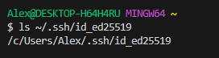
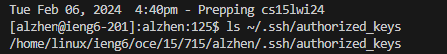
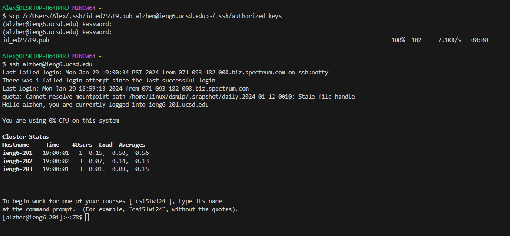

# CSE 15L - Lab Report 2 - Alexander Zhen

## Part 1: Creating ChatServer.java 

### Code used for ChatServer.java, similar to NumberServer.java
```
import java.io.IOException;
import java.net.URI;

class Handler implements URLHandler {
 
    String add_message = "";
    String user = ""; //added new strings, instead of int num.
    String message = "";

    public String handleRequest(URI url) {
        if (url.getPath().equals("/add-message")) { //instead of "/", need to use "/add-message"
            String[] parameters = url.getQuery().split("&");
            //using url.getQuery() like in NumberServer.java, but using '&' to help split up the string when there's a '&' in the link.
            message = parameters[0].split("=")[1];
            //splitting the string, takes some parameter 's' and then divides it on '=' at index [0] and then some value = our message on index [1]. 
            user = parameters[1].split("=")[1];
            //after splitting on '&', takes the 'user' parameter and then divides it on '=' at index [1] and then some value = username on index [1]
 
            add_message += user + ": " + message + "\n"; //concatenates and to format the output

            return add_message;

        } 
        else {
            return "404 Not Found!";
        }
    }
}

class ChatServer { //same part from NumberServer.java
    public static void main(String[] args) throws IOException {
        if (args.length == 0) {
            System.out.println("Missing port number! Try any number between 1024 to 49151");
            return;
        }

        int port = Integer.parseInt(args[0]);

        Server.start(port, new Handler());
    }
}
```

---

### Screenshots of using `/add-message`


> * The method used was the same for `NumberServer.java`, but had to restructure it to satisfy the lab requirements. Switching out the variables and adding string variables for the individual components, like `user`, `message`, and then the combined result of `add_message`. Instead of `/`, changed it to `/add-message` to satisfy the if-loop and to check if the path part of the URL contains `/add-message` in order to continue on, if not, it'll spit out *"404 Not Found!"*. 
> * The relevant arguments in this screenshot would be the path part of the url, which would be `/add-message?s=Hello&user=AlexZhen`. For the relevant fields in this screenshot, it would be the empty string variables: `add_message`, `user`, and `message`. 
> * When the `/add-message` path part of the URL is added, alongside `s=Hello&user=AlexZhen`, the relevant fields or the empty string variables are changed. The `message` variable receives a value of `"Hello"`, the `user` variable receives a value of `"AlexZhen"`, and the concatenated variable of 'add_message' receives a value of `"AlexZhen: Hello"`.


--- 


> * The method used was the same for `NumberServer.java` and the previous screenshot, simiarly had to restructure it to satisfy the lab requirements. Switching out the variables and adding string variables for the individual components, like `user`, `message`, and then the combined result of `add_message`. Instead of `/`, changed it to `/add-message` to satisfy the if-loop and to check if the path part of the URL contains `/add-message` in order to continue on, if not, it'll spit out *"404 Not Found!"*.
> * The relevant arguments in this screen would be the path part of the url, which would be `/add-message?s=How%20are%20you&user=KrisZhen`, the `%20` part of the path was supposed to be spaces in between. For the relevant fields in this screen shot, it would be the same as before, the empty string variables: `add_message`, `user`, and `message`.
> * When the `/add-message` path part of the URL is added, alongside `s=How%20are%20you&user=KrisZhen`, the relevant fields or the empty string variables are changed. The `message` variable receives a value of `"How+are+you"`, the `user` variables receives a value of `"KrisZhen"`, and the concatenated variable of `add_message` receives a value of `"KrisZhen: How+are+you"`.

---

## Part 2:

### The absolute path to my *private* key for logging into `ieng6`.



> When I ran `ssh-keygen` and continued past until I reached a "randomart image", logging onto my `ieng6` account and creating a directory using `mkdir .ssh`, my public key was saved in `/Users/Alex/.ssh/id_ed25519.pub`. Then, I ran the `scp /Users/Alex/.ssh/id_ed25519.pub alzhen@ieng6.ucsd.edu:~/.ssh/authorized_keys`, which securely copied the files between two different computers, which I believe is between the CSE Lab and my own personal computer. Therefore, the path to my private key using the `ls` command to list the contents of a file, would be `c/User/Alex/.ssh/id_ed25519`. 

### The absolute path to my *public* key for logging into `ieng6`.



> Using the same set of instructions as before, I have generated a public key to `/Users/Alex/.ssh/id_ed25519.pub`. After that, I logged into my remote account `alzhen@ieng6.ucsd.edu` and using `ls ~/.ssh/authorized_keys`, it gave me an absolute path for my public key, which is `/home/linux/ieng6/oce/15/715/alzhen/.ssh/authorized_keys`.


### A terminal interaction where I logged into my `ieng6` account *without* being asked for a password.



> After I entered `scp /Users/Alex/.ssh/id_ed25519.pub alzhen@ieng6.ucsd.edu:~/.ssh/authorized_keys` in the terminal, logging into my `ieng6` aaccount, it securely copied files onto my personal computer. I believe that when we created a file called `authorized_keys` and then stored the path of my public key, the server checks the `~/.ssh/authorized_keys` file for a public key, it sort of verifies that it is me through the stored public key/personal computer and the `ieng` account.

---

## Part 3:

> Implementing what I learned from weeks 2 and 3 was a little bit rough at the beginning. This was my first time experimenting with URLs and implementing them on the servers, which was also my first time starting up a server and having others visit that particular url. Learning about creating and setting up an SSH key was also my first time, and it was a very interesting process. It was confusing at first, but once I sort of sat down, took it apart, and learned the meanings of the commands, it became more understandable.
